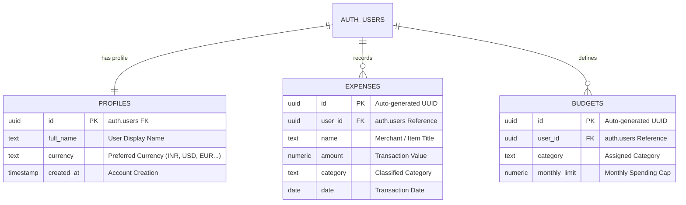

# 💎 Ledgio — The Intelligent Private Financial Ledger

<div align="center">


**An intelligent, local-first visual ledger engineered for precision, speed, and 100% private personal budgeting.**

### 📱 Try it live: https://code-breaker-ctrl.github.io/Ledgio
> **Install**: Open the link in Chrome → tap **Install App**

[Features](#-features) • [Installation](#-app-installation) • [Architecture](#-architecture) • [Database Design](#-database-design) • [Quick Start](#-quick-start)

</div>

---

## 🌟 Highlights & Features

### 🌌 3D Interactive UI & Ambient Lighting
- **Scroll-Driven Ambient Mesh**: Dynamic background lighting that smoothly morphs across sections.
- **Mouse-Tracking 3D Tilt**: Real-time perspective transformations reacting to cursor movement.
- **Glassmorphic Floating Chips**: Floating transaction cards with layered depth and physics.

### 📱 Installable Desktop & Mobile App (PWA)
- **Standalone App Experience**: Installs directly onto Windows/Mac with a desktop shortcut or onto Android/iOS home screens.
- **100% Offline Capability**: Built-in Service Worker (`sw.js`) caches all assets for sub-second offline launches.
- **Native Quick Shortcuts**: Long-press or right-click app icon to jump straight into *Add Expense*, *Ledger*, or *Budgets*.

### 🛡️ Supabase Cloud Sync & Local Privacy
- **Row Level Security (RLS)**: PostgreSQL policies guarantee complete data isolation between accounts.
- **Encrypted Authentication**: Secure email & password auth with session recovery.
- **Multi-Device Synchronization**: Seamless real-time data sync across all your phones and computers.

### 📊 Comprehensive Financial Engine
- **10 Smart Categories**: Food & Dining, Transport, Housing, Entertainment, Shopping, Health, Education, Bills, Savings, Other.
- **Visual Category Caps**: Dynamic progress meters (<75% Green, 75–90% Warning, >90% Critical).
- **Interactive Analytics**: 6-month historical spending trends and category breakdown charts.
- **Multi-Currency & Dual Export**: Localized numbering formats (`₹ INR`, `$ USD`, `€ EUR`, `£ GBP`, etc.) and 1-click CSV/JSON export.

---

## 📲 App Installation

Ledgio runs as a native standalone application on all operating systems:

```
┌─────────────────────────────────────────────────────────────┐
│                      📲 INSTALL LEDGIO                      │
├──────────────────────────────┬──────────────────────────────┤
│ 💻 Desktop (Windows / macOS) │ 📱 Mobile (Android / iOS)    │
├──────────────────────────────┼──────────────────────────────┤
│ 1. Open Ledgio in browser    │ 1. Open Ledgio in Chrome/Safari
│ 2. Click "Install App"       │ 2. Tap Share / Menu (⋮)      │
│ 3. Access via Taskbar/Desktop│ 3. Tap "Add to Home Screen"  │
└──────────────────────────────┴──────────────────────────────┘
```

---

## 🗄️ Database Design



### Table Specifications & Security

| Table | Purpose | Security Policy (RLS) |
| :--- | :--- | :--- |
| **`profiles`** | Stores user identity, avatar details, and currency preference. | Restricted strictly to `auth.uid() = id` |
| **`expenses`** | Transaction records, category mappings, and amounts. | Isolated per account (`auth.uid() = user_id`) |
| **`budgets`** | Monthly spending targets per category. | Unique per `(user_id, category)` combo |

---

## 🏗️ Architecture & File Structure

```
ledgio/
├── index.html            # 3D SaaS Landing Page & Live Simulator
├── dashboard.html        # Core Financial Application (5 Tab Views)
├── login.html            # Luxury Split-Screen Login
├── signup.html           # Luxury Split-Screen Signup
├── app.js                # Core Financial Engine & Cloud Sync
├── auth.js               # Supabase Auth Handlers & Session Guard
├── pwa-installer.js      # PWA Install Prompts & Connectivity Monitor
├── sw.js                 # Offline Service Worker & Asset Caching
├── supabase-config.js    # Cloud Database Client Configuration
├── styles.css            # 3D Design Tokens, Mesh Lighting & Auth CSS
├── dashboard.css         # Dashboard Grid, Badges & Micro-Interactions
├── manifest.json         # PWA Manifest & App Shortcuts
└── README.md             # Project Documentation
```

---

## 🚀 Quick Start Guide

1. **Clone the repository**:
   ```bash
   git clone https://github.com/Code-Breaker-Ctrl/Ledgio.git
   cd Ledgio
   ```

2. **Configure Supabase**:
   Open `supabase-config.js` and ensure your Supabase project URL and anon public key are set:
   ```javascript
   window.SUPABASE_CONFIG = {
     url: 'https://your-project.supabase.co',
     anonKey: 'your-anon-public-key'
   };
   ```

3. **Launch the App**:
   Serve with any static web server (e.g. VS Code Live Server) or deploy to GitHub Pages!

---

## 🛠️ Tech Stack

- **Frontend**: Vanilla JavaScript (ES6+), HTML5, CSS3 Glassmorphism
- **PWA & Offline**: Service Worker API, Web App Manifest
- **Database & Auth**: [Supabase](https://supabase.com) (PostgreSQL, Row Level Security, Auth)
- **Charts & Visuals**: [Chart.js](https://www.chartjs.org/)
- **Icons & Typography**: Font Awesome 6, Plus Jakarta Sans, Space Grotesk

---

## 📄 License

This project is licensed under the MIT License — free for personal and commercial use.
