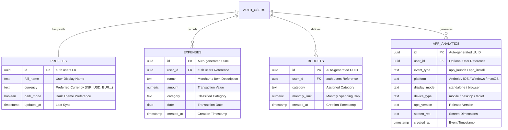

# 💎 Ledgio — Intelligent Private Financial Ledger

<div align="center">

[](LICENSE)
[](https://github.com/Code-Breaker-Ctrl/Ledgio)
[](https://supabase.com)
[](https://code-breaker-ctrl.github.io/Ledgio/)
[](https://code-breaker-ctrl.github.io/Ledgio/)

**An intelligent, local-first visual financial ledger engineered for speed, privacy, and seamless multi-device budgeting.**

### 🌐 [Launch Live App: code-breaker-ctrl.github.io/Ledgio](https://code-breaker-ctrl.github.io/Ledgio/)

[Key Features](#-key-features) • [Installation Guide](#-app-installation-guide) • [Architecture](#-architecture--file-structure) • [Database Design](#-database-design) • [Quick Start](#-quick-start) • [Tech Stack](#-tech-stack)

</div>

---

## 🌟 Key Features

### 🌌 3D Interactive UI & Ambient Lighting
- **Scroll-Driven Ambient Mesh**: Dynamic background lighting that smoothly morphs across sections in light and dark mode.
- **Glassmorphic Floating Cards & Tilt**: Real-time perspective transformations reacting to cursor and touch movement.
- **Zero-Flicker Synchronous Theme Engine**: Dark & light mode preferences apply instantly in `<head>` before paint with no white flash.

### 📱 100% Offline-First PWA & Universal Installation
- **Multi-Platform Standalone App**: Installs natively onto Windows, macOS, Android, and iOS home screens.
- **Sub-Second Offline Launches**: Built-in Service Worker (`sw.js`) caches all assets for continuous operation without internet.
- **Intelligent Install Fallback Engine**: One-tap installation on Chrome/Edge/Android, with tailored step-by-step guidance for iOS Safari, Mi/Oppo Browser, and in-app webviews (Instagram, WhatsApp, Facebook).
- **Proactive Background Updater**: Live floating pill notification when new features are ready with instant zero-downtime refresh.

### 🔒 Sticky Auth & Multi-Device Cloud Sync
- **Persistent Sticky Sessions**: Stays logged in securely across app restarts and offline launches until explicit sign out.
- **PostgreSQL Row Level Security (RLS)**: Bank-grade access control guarantees strict data isolation per user account.
- **Real-Time Cloud Backup**: Seamless two-way data sync between local device storage and Supabase cloud.

### 📊 Comprehensive Financial Ledger & Analytics
- **Touch-Optimized Mobile Ledger**: Responsive stacked card ledger on mobile with 46px touch-friendly search and category chips.
- **2x2 Compact Stat Grids**: View Income, Expenses, Remaining Balance, and Savings Rate in a single glance.
- **Dynamic Category Caps**: Visual progress meters (<75% Green, 75–90% Amber Warning, >90% Critical Alert).
- **Interactive Visual Analytics**: 6-month historical spending trends and category breakdown charts.
- **Multi-Currency & Dual Export**: Support for `₹ INR`, `$ USD`, `€ EUR`, `£ GBP`, `د.إ AED`, `S$ SGD`, `CA$ CAD`, `A$ AUD`, `¥ JPY` with 1-click CSV and JSON exports.

---

## 📲 App Installation Guide

Ledgio runs as a standalone progressive web application across all modern platforms:

```
┌─────────────────────────────────────────────────────────────────────────────┐
│                             📲 INSTALL LEDGIO                               │
├──────────────────────────────┬──────────────────────────────────────────────┤
│ 💻 Desktop (Windows / Mac)   │ 📱 Mobile (Android / iOS / Mi / WebViews)    │
├──────────────────────────────┼──────────────────────────────────────────────┤
│ 1. Open Ledgio in Chrome/Edge│ 1. Android: Tap "Install App" or Menu (⋮)    │
│ 2. Click "Install App"       │ 2. iOS Safari: Tap Share (⬆) → "Add to Home" │
│ 3. Launch via Desktop/Taskbar│ 3. Webviews: Tap (⋮) → "Open in Chrome"      │
└──────────────────────────────┴──────────────────────────────────────────────┘
```

---

## 🗄️ Database Design



### Table Specifications & Security

| Table | Purpose | Security Policy (RLS) |
| :--- | :--- | :--- |
| **`profiles`** | Stores user identity, avatar name, theme, and currency preferences. | Restricted strictly to `auth.uid() = id` |
| **`expenses`** | Transaction records, category mappings, dates, and amounts. | Isolated per account (`auth.uid() = user_id`) |
| **`budgets`** | Monthly spending limits and category allocations. | Unique per `(user_id, category)` combo |
| **`app_analytics`** | Privacy-first installation and launch telemetry tracking. | Write-allowed with anonymous public key |

---

## 🏗️ Architecture & File Structure

```
Ledgio/
├── index.html            # 3D SaaS Landing Page & Live Budget Simulator
├── dashboard.html        # Core Financial Application (5 Modular Views)
├── login.html            # Split-Screen Responsive Login Portal
├── signup.html           # Split-Screen Responsive Signup Portal
├── app.js                # Core Financial Engine, State & Cloud Sync (Unminified)
├── app.min.js            # Production Minified Engine
├── auth.js               # Supabase Auth Handlers & Persistent Session Guard
├── auth.min.js           # Production Minified Auth Module
├── pwa-installer.js      # PWA Install Prompts, Diagnostics & Device Fallback
├── pwa-installer.min.js  # Production Minified PWA Engine
├── sw.js                 # Offline-First Service Worker & Cache Manager
├── supabase-config.js    # Cloud Database Client Configuration
├── styles.css            # 3D Design Tokens, Mesh Lighting & Theme CSS
├── styles.min.css        # Production Minified Theme Styles
├── dashboard.css         # Dashboard Grid, Badges & Mobile Responsive CSS
├── dashboard.min.css     # Production Minified Dashboard Styles
├── manifest.json         # PWA Manifest, Shortcuts & Maskable Icons
├── icon-192.png          # App Launcher Icon (192x192)
├── icon-512.png          # High-Res Launcher Icon (512x512)
├── icon-maskable-512.png # Adaptive Maskable Android Icon (512x512)
└── README.md             # Project Documentation
```

---

## 🚀 Quick Start

1. **Clone the repository**:
   ```bash
   git clone https://github.com/Code-Breaker-Ctrl/Ledgio.git
   cd Ledgio
   ```

2. **Configure Supabase**:
   Open `supabase-config.js` and set your Supabase project URL and anon public key:
   ```javascript
   window.SUPABASE_CONFIG = {
     url: 'https://your-project.supabase.co',
     anonKey: 'your-anon-public-key'
   };
   ```

3. **Launch the Application**:
   Serve with any static web server (e.g., Live Server, Python `http.server`, or Nginx) or deploy directly to GitHub Pages:
   ```bash
   # Quick local launch with Python
   python -m http.server 8000
   ```
   Open `http://localhost:8000` in your browser.

---

## 🛠️ Tech Stack

- **Frontend**: Vanilla JavaScript (ES6+), HTML5, CSS3 Glassmorphism
- **PWA & Offline**: Service Worker API (`sw.js`), Web App Manifest (`manifest.json`)
- **Database & Auth**: [Supabase](https://supabase.com) (PostgreSQL 15, Row Level Security, Auth)
- **Charts & Visuals**: [Chart.js](https://www.chartjs.org/)
- **Icons & Typography**: Font Awesome 6, Plus Jakarta Sans, Space Grotesk

---

## 📄 License

This project is licensed under the **MIT License** — free for personal and commercial use.

---

<div align="center">
Made with ❤️ by <strong>Code-Breaker-Ctrl</strong> • <a href="https://code-breaker-ctrl.github.io/Ledgio/">Live Demo</a>
</div>
