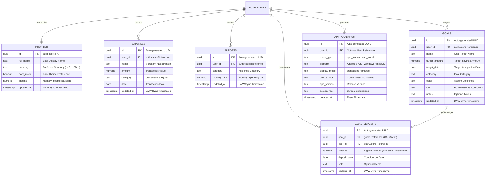

# 💎 Ledgio — Intelligent Private Financial Ledger

<div align="center">

[](LICENSE)
[](https://github.com/Code-Breaker-Ctrl/Ledgio)
[](https://supabase.com)
[](https://code-breaker-ctrl.github.io/Ledgio/)
[](https://code-breaker-ctrl.github.io/Ledgio/)
[](https://code-breaker-ctrl.github.io/Ledgio/)

**An intelligent, local-first visual financial ledger engineered for speed, privacy, and seamless multi-device budgeting.**

### 🌐 [Launch Live App: code-breaker-ctrl.github.io/Ledgio](https://code-breaker-ctrl.github.io/Ledgio/)

[Key Features](#-key-features) • [Installation Guide](#-app-installation-guide) • [Architecture](#-architecture--file-structure) • [Database Design](#-database-design) • [Quick Start](#-quick-start) • [Tech Stack](#-tech-stack) • [Roadmap](#-roadmap)

</div>

---

## 🌟 Key Features

### 🌌 3D Interactive UI & Ambient Lighting
- **Scroll-Driven Ambient Mesh**: Dynamic background lighting that smoothly morphs across sections in light and dark mode.
- **Glassmorphic Floating Cards & Tilt**: Real-time perspective transformations reacting to cursor and touch movement.
- **Zero-Flicker Synchronous Theme Engine**: Dark & light mode preferences apply instantly in `<head>` before paint with no white flash.

### 📱 100% Offline-First PWA & Universal Installation
- **Multi-Platform Standalone App**: Installs natively onto Windows, macOS, Android, and iOS home screens.
- **Sub-Second Offline Launches**: Built-in Service Worker (`sw.js`) caches all assets for continuous operation without internet.
- **Intelligent Install Fallback Engine**: One-tap installation on Chrome/Edge/Android, with tailored step-by-step guidance for iOS Safari, Mi/Oppo Browser, and in-app webviews (Instagram, WhatsApp, Facebook).
- **Proactive Background Updater**: Live floating pill notification when new features are ready with instant zero-downtime refresh.

### ⚡ Offline-First Sync Engine
- **0ms Optimistic Mutations**: Immediate local UI updates with zero latency before any network roundtrip.
- **Persistent FIFO Mutation Queue**: Queues all database operations locally when offline or disconnected.
- **Background Replay with Exponential Backoff**: Automatically replays queued mutations once network connectivity returns.
- **Per-Record Last-Write-Wins (LWW)**: Deterministic timestamp-based conflict resolution prevents data overwrites across devices.
- **Dead-Letter Recovery**: Isolates poison-pill mutations to prevent queue blockage while preserving local state.
- **Cross-Tab Live Sync (`BroadcastChannel`)**: Multi-window state broadcasting updates open tabs instantly without manual reload.
- **Interactive Sync Diagnostics Hub**: Real-time status pill (Cloud Synced, Syncing, Offline Queue) with on-demand force-sync trigger.
- **Reset Tombstones**: Clean account resets and wipes propagate safely across offline caches.

### 🔐 Private Vault & Security
- **4-Digit PIN Lock**: Cryptographically protected with client-side SHA-256 hashing with per-user salt.
- **WebAuthn Biometric Unlock**: Hardware-backed platform authenticators (Touch ID, Face ID, fingerprint sensors, Windows Hello).
- **Inactivity Auto-Lock**: Configurable timers (Immediate, 1 min, 3 min, 5 min, 15 min, Never) automatically engage the lock screen.
- **Stealth Balance Masking**: 1-click toggle masks sensitive currency figures (`••••••`) and percentages (`••%`) across the entire UI.
- **Brute-Force Rate Limiting**: Escalating timeout penalties on consecutive incorrect PIN attempts protect against unauthorized physical access.
- **Reset Vault PIN Escape Hatch**: Secure recovery path to reset credentials without corrupting underlying financial records.

### 🎯 Savings Goals & Milestones
- **Target Buckets**: Categorized savings goals with target amounts, target dates, custom icons, and accent colors.
- **First-Class Deposit/Withdraw Ledger**: Additive ledger records (`goal_deposits`) ensure conflict-free mathematical consistency across devices — goal balances are computed dynamically, never stored statically.
- **Visual Milestones & Progress Tracking**: Real-time progress bars, days remaining badges, and filter pills (All, In Progress, Completed).
- **Completion Celebration**: Canvas confetti animation celebrates reached milestones upon achieving 100% target funding.

### 🔑 Authentication & Identity
- **Flexible Auth Providers**: Email/Password authentication plus seamless one-click Google and GitHub OAuth.
- **Multi-Provider Account Linking**: Supabase automatically unifies provider logins sharing the same email into a single profile.
- **Persistent Sticky Sessions**: Stays logged in securely across app restarts and offline launches until explicit sign out.
- **Self-Service Credentials**: Built-in profile management with email and password update flows.

### 📊 Financial Ledger, Multi-Currency & Analytics
- **12 Live Currencies**: Real-time exchange rate engine syncing daily with cached offline fallbacks (`₹ INR`, `$ USD`, `€ EUR`, `£ GBP`, `د.إ AED`, `S$ SGD`, `CA$ CAD`, `A$ AUD`, `¥ JPY`, `﷼ SAR`, `৳ BDT`, `रू NPR`).
- **Touch-Optimized Mobile Ledger**: Responsive stacked card ledger with 46px touch targets, search, and category chips.
- **2x2 Compact Stat Grids**: Income, Expenses, Remaining Balance, and Savings Rate with dynamic visual category spending caps.
- **Interactive Visual Analytics**: 6-month historical spending trends, category breakdown charts, and 1-click CSV and JSON data exports.

---

## 📲 App Installation Guide

Ledgio runs as a standalone progressive web application across all modern platforms:

```
┌─────────────────────────────────────────────────────────────────────────────┐
│                             📲 INSTALL LEDGIO                               │
├──────────────────────────────┬──────────────────────────────────────────────┤
│ 💻 Desktop (Windows / Mac)   │ 📱 Mobile (Android / iOS / Mi / WebViews)    │
├──────────────────────────────┼──────────────────────────────────────────────┤
│ 1. Open Ledgio in Chrome/Edge│ 1. Android: Tap "Install App" or Menu (⋮)    │
│ 2. Click "Install App"       │ 2. iOS Safari: Tap Share (⬆) → "Add to Home" │
│ 3. Launch via Desktop/Taskbar│ 3. Webviews: Tap (⋮) → "Open in Chrome"      │
└──────────────────────────────┴──────────────────────────────────────────────┘
```

---

## 🗄️ Database Design



> **Note**: All tables RLS-isolated per user; deposits are first-class records — goal balances are computed, never stored.

### Table Specifications & Security

| Table | Purpose | Security Policy (RLS) |
| :--- | :--- | :--- |
| **`profiles`** | User identity, avatar name, theme, income baseline, and currency preferences. | Restricted strictly to `auth.uid() = id` |
| **`expenses`** | Transaction records, category mappings, dates, amounts, and LWW timestamps. | Isolated per account (`auth.uid() = user_id`) |
| **`budgets`** | Monthly spending limits and category allocations. | Unique per `(user_id, category)` combo |
| **`goals`** | Target savings buckets (metadata and targets only; balance computed from deposits). | Isolated per account (`auth.uid() = user_id`) |
| **`goal_deposits`** | First-class signed ledger records (+ deposit, - withdrawal). | Cascade deleted with parent goal; isolated to `auth.uid() = user_id` |
| **`app_analytics`** | Privacy-first installation and launch telemetry tracking. | Write-allowed with anonymous public key |

---

## 🏗️ Architecture & File Structure

```
Ledgio/
├── assets/
│   ├── css/
│   │   ├── styles.css            # 3D Design Tokens, Mesh Lighting & Theme CSS
│   │   ├── styles.min.css        # Production Minified Theme Styles
│   │   ├── dashboard.css         # Dashboard Grid, Badges & Mobile Responsive CSS
│   │   └── dashboard.min.css     # Production Minified Dashboard Styles
│   ├── js/
│   │   ├── app.js                # Core Financial Engine, Vault & State (Unminified)
│   │   ├── app.min.js            # Production Minified Financial Engine
│   │   ├── auth.js               # Supabase Auth & OAuth Handlers (Unminified)
│   │   ├── auth.min.js           # Production Minified Auth Module
│   │   ├── pwa-installer.js      # PWA Install Prompts, Diagnostics & Device Fallback
│   │   ├── pwa-installer.min.js  # Production Minified PWA Engine
│   │   ├── supabase-config.js    # Cloud Database Client Configuration
│   │   └── supabase-config.min.js# Production Minified Database Client Config
│   └── icons/
│       ├── favicon.png           # Browser Tab Icon (32x32)
│       ├── apple-touch-icon.png  # iOS Safari Web Clip Icon (180x180)
│       ├── icon-192.png          # App Launcher Icon (192x192)
│       ├── icon-512.png          # High-Res Launcher Icon (512x512)
│       └── icon-maskable-512.png # Adaptive Maskable Android Icon (512x512)
│
├── backend/
│   ├── migrations/
│   │   ├── phase3_offline_sync.sql   # Offline-first sync engine & LWW triggers
│   │   └── phase4_savings_goals.sql  # Savings goals & first-class deposits DDL
│   ├── README.md                     # Database Architecture & Deployment Guide
│   ├── supabase-schema.sql           # Base PostgreSQL DDL, RLS Policies & Triggers
│   └── verify_schema_phase4.sql      # Schema & FK verification script
│
├── scripts/
│   ├── build.ps1                 # Automated UTF-8 Asset Minifier (auto-bumps SW cache)
│   └── test_runtime_gate.ps1     # Headless Browser Runtime Regression Suite
│
├── tests/
│   └── headless_regression.html  # Interactive in-browser DOM assertion harness
│
├── .gitignore                    # Git Exclusion Rules & Secrets Shield
├── README.md                     # Comprehensive Project Documentation
├── index.html                    # 3D SaaS Landing Page & Live Budget Simulator
├── dashboard.html                # Core Financial Application (5 Modular Views)
├── login.html                    # Split-Screen Responsive Login Portal (OAuth Enabled)
├── signup.html                   # Split-Screen Responsive Signup Portal (OAuth Enabled)
├── manifest.json                 # PWA Web App Manifest, Shortcuts & Configuration
└── sw.js                         # Root-Scoped Offline Service Worker (version auto-bumps per build)
```

---

## 🚀 Quick Start

1. **Clone the repository**:
   ```bash
   git clone https://github.com/Code-Breaker-Ctrl/Ledgio.git
   cd Ledgio
   ```

2. **Run Database Migrations**:
   In your [Supabase SQL Editor](https://supabase.com/dashboard), run the base schema and migration scripts in order before initiating cloud sync:
   - `backend/supabase-schema.sql` (base schema & RLS policies)
   - `backend/migrations/phase3_offline_sync.sql` (LWW timestamp triggers & offline engine)
   - `backend/migrations/phase4_savings_goals.sql` (goals & goal deposits ledger)
   - *(Optional)* `backend/verify_schema_phase4.sql` to assert schema validity.

3. **Configure Supabase & OAuth**:
   - Open `assets/js/supabase-config.js` and set your Supabase project URL and anon key:
     ```javascript
     window.SUPABASE_CONFIG = {
       url: 'https://your-project.supabase.co',
       anonKey: 'your-anon-public-key'
     };
     ```
   - **OAuth Setup**: In the Supabase Dashboard under *Authentication → URL Configuration*, set the Site URL to your domain (e.g. `https://<username>.github.io/Ledgio/`) and add redirect URLs for `/dashboard.html`, `/`, and `/login.html`. Under *Authentication → Providers*, enable Google and/or GitHub with your OAuth client credentials (see Supabase Auth docs).

4. **Launch the Application**:
   Serve with any static web server or deploy directly to GitHub Pages:
   ```bash
   # Quick local launch with Python
   python -m http.server 8000
   ```
   Open `http://localhost:8000` in your browser.

---

## 🛠️ Tech Stack

- **Frontend**: Vanilla JavaScript (ES6+), HTML5, CSS3 Glassmorphism, IntersectionObserver, CSS `content-visibility`
- **PWA & Offline**: Service Worker API (`sw.js`), Web App Manifest (`manifest.json`), `BroadcastChannel` API (cross-tab real-time sync)
- **Security & Hardware**: WebAuthn API (`PublicKeyCredential` for biometrics), Web Crypto API (SHA-256 salted PIN hashing)
- **Database & Auth**: [Supabase](https://supabase.com) (PostgreSQL 15, Row Level Security, GoTrue Auth with Email + Google/GitHub OAuth)
- **Charts & Visuals**: [Chart.js](https://www.chartjs.org/), Canvas Confetti
- **Icons & Typography**: Font Awesome 6, Plus Jakarta Sans, Space Grotesk
- **Testing & Quality Assurance**: Headless Edge/Chrome browser runtime regression suite (`scripts/test_runtime_gate.ps1` running 49 interactive DOM assertions)

---

## 🗺️ Roadmap

- 📄 **PDF Financial Statements**: Downloadable monthly and annual summary statements formatted for print and archiving (planned).
- 🎙️ **Voice / NLP Quick-Logger**: Hands-free natural language expense logging ("Spent $15 on lunch") (planned).
- 📦 **TWA / Play Store Packaging**: Trusted Web Activity wrapper with native Android `BiometricPrompt` bridge for hardware biometrics (future scope).

---

## 📄 License

This project is licensed under the **MIT License** — free for personal and commercial use.

---

<div align="center">
Made with ❤️ by <strong>Code-Breaker-Ctrl</strong> • <a href="https://code-breaker-ctrl.github.io/Ledgio/">Live Demo</a>
</div>
