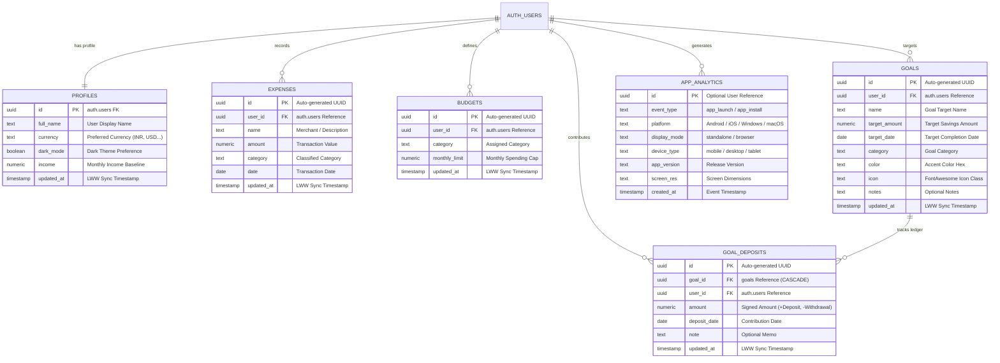

<div align="center">

# 💎 Ledgio

### Intelligent, Private, Offline-First Financial Ledger

*A visual financial ledger engineered for speed, privacy, and seamless multi-device budgeting.*

<br/>

[](LICENSE)
[](https://github.com/Code-Breaker-Ctrl/Ledgio)
[](https://supabase.com)
[](https://code-breaker-ctrl.github.io/Ledgio/)
[](https://code-breaker-ctrl.github.io/Ledgio/)

<br/>

### 🌐 **[Launch the Live App →](https://code-breaker-ctrl.github.io/Ledgio/)**

<br/>

**[Features](#-key-features)** • **[Install](#-app-installation-guide)** • **[Architecture](#️-architecture--file-structure)** • **[Database](#️-database-design)** • **[Quick Start](#-quick-start)** • **[Tech Stack](#️-tech-stack)** • **[Roadmap](#️-roadmap)**

</div>

---

## ✨ Why Ledgio?

Ledgio isn't just another budgeting app — it's a **local-first vault** that works fully offline, syncs seamlessly the moment you're back online, and never asks you to trust a server with your unencrypted data. Glassmorphic 3D UI meets bank-grade sync engineering.

---

## 🌟 Key Features

<table>
<tr>
<td width="50%" valign="top">

### 🌌 3D Interactive UI
- **Scroll-Driven Ambient Mesh** — background lighting morphs across sections in light & dark mode
- **Glassmorphic Floating Cards & Tilt** — real-time perspective transforms on cursor/touch
- **Zero-Flicker Theme Engine** — theme applies in `<head>` before paint, no white flash

</td>
<td width="50%" valign="top">

### 📱 100% Offline-First PWA
- **Multi-Platform Install** — Windows, macOS, Android, iOS home screens
- **Sub-Second Offline Launches** — Service Worker (`sw.js`) caches every asset
- **Smart Install Fallback** — one-tap on Chrome/Edge/Android, guided steps for iOS Safari, Mi/Oppo, and in-app webviews
- **Background Updater** — floating pill notifies of updates, zero-downtime refresh

</td>
</tr>
<tr>
<td width="50%" valign="top">

### ⚡ Offline-First Sync Engine
- **0ms Optimistic Mutations** — instant local UI, no waiting on the network
- **Persistent FIFO Mutation Queue** — queues writes while offline/disconnected
- **Exponential Backoff Replay** — auto-replays the queue once reconnected
- **Per-Record Last-Write-Wins** — deterministic, timestamp-based conflict resolution
- **Dead-Letter Recovery** — isolates poison-pill mutations without blocking the queue
- **Cross-Tab Live Sync** — `BroadcastChannel` keeps every open tab in sync
- **Sync Diagnostics Hub** — live status pill + on-demand force-sync
- **Reset Tombstones** — clean resets/wipes propagate safely across offline caches

</td>
<td width="50%" valign="top">

### 🔐 Private Vault & Security
- **4-Digit PIN Lock** — client-side SHA-256 hashing with per-user salt
- **WebAuthn Biometric Unlock** — Touch ID, Face ID, fingerprint, Windows Hello
- **Inactivity Auto-Lock** — Immediate / 1 / 3 / 5 / 15 min / Never
- **Stealth Balance Masking** — 1-click mask for amounts (`••••••`) and percentages (`••%`)
- **Brute-Force Rate Limiting** — escalating timeouts on failed PIN attempts
- **Vault PIN Escape Hatch** — secure recovery without corrupting your records

</td>
</tr>
<tr>
<td width="50%" valign="top">

### 🎯 Savings Goals & Milestones
- **Target Buckets** — goals with amounts, dates, custom icons & accent colors
- **First-Class Deposit/Withdraw Ledger** — additive `goal_deposits` keep math conflict-free across devices; balances are always computed, never stored
- **Visual Milestones** — progress bars, days-remaining badges, filter pills (All / In Progress / Completed)
- **Completion Celebration** — confetti animation at 100% funded 🎉

</td>
<td width="50%" valign="top">

### 🔑 Authentication & Identity
- **Flexible Providers** — Email/Password + one-click Google & GitHub OAuth
- **Multi-Provider Linking** — Supabase unifies logins sharing the same email
- **Persistent Sticky Sessions** — stays signed in across restarts & offline launches
- **Self-Service Credentials** — built-in email/password update flows

</td>
</tr>
</table>

### 📊 Financial Ledger, Multi-Currency & Analytics

| | |
|---|---|
| 💱 **12 Live Currencies** | Real-time exchange rates, synced daily with cached offline fallback — `₹` `$` `€` `£` `د.إ` `S$` `CA$` `A$` `¥` `﷼` `৳` `रू` |
| 📱 **Touch-Optimized Ledger** | Responsive stacked cards, 46px touch targets, search, category chips |
| 📈 **2×2 Stat Grids** | Income, Expenses, Remaining Balance, Savings Rate with visual spend caps |
| 📉 **Interactive Analytics** | 6-month spending trends, category breakdowns, 1-click CSV/JSON export |

---

## 📲 App Installation Guide

<div align="center">

| 💻 Desktop (Windows / Mac) | 📱 Mobile (Android / iOS / Mi / WebViews) |
|:---|:---|
| 1️⃣ Open Ledgio in Chrome or Edge | 1️⃣ **Android** — tap **Install App** or Menu (⋮) |
| 2️⃣ Click **Install App** | 2️⃣ **iOS Safari** — tap Share (⬆) → **Add to Home Screen** |
| 3️⃣ Launch from Desktop / Taskbar | 3️⃣ **Webviews** — tap (⋮) → **Open in Chrome** |

</div>

---

## 🗄️ Database Design



> 🔒 **Every table is RLS-isolated per user.** Deposits are first-class records — goal balances are always *computed*, never stored.

<details>
<summary><b>📋 Table Specifications & Security Policies</b></summary>
<br/>

| Table | Purpose | Security Policy (RLS) |
| :--- | :--- | :--- |
| **`profiles`** | Identity, avatar name, theme, income baseline, currency preferences | Restricted to `auth.uid() = id` |
| **`expenses`** | Transaction records, category mappings, dates, amounts, LWW timestamps | Isolated per account (`auth.uid() = user_id`) |
| **`budgets`** | Monthly spending limits and category allocations | Unique per `(user_id, category)` |
| **`goals`** | Target savings buckets — metadata & targets only, balance computed from deposits | Isolated per account (`auth.uid() = user_id`) |
| **`goal_deposits`** | First-class signed ledger records (`+` deposit, `-` withdrawal) | Cascades with parent goal, isolated to `auth.uid() = user_id` |
| **`app_analytics`** | Privacy-first install/launch telemetry | Write-allowed with anonymous public key |

</details>

---

## 🏗️ Architecture & File Structure

<details>
<summary><b>📂 Click to expand full project tree</b></summary>

```
Ledgio/
├── assets/
│   ├── css/
│   │   ├── styles.css            # 3D Design Tokens, Mesh Lighting & Theme CSS
│   │   ├── styles.min.css        # Production Minified Theme Styles
│   │   ├── dashboard.css         # Dashboard Grid, Badges & Mobile Responsive CSS
│   │   └── dashboard.min.css     # Production Minified Dashboard Styles
│   ├── js/
│   │   ├── app.js                # Core Financial Engine, Vault & State (Unminified)
│   │   ├── app.min.js            # Production Minified Financial Engine
│   │   ├── auth.js               # Supabase Auth & OAuth Handlers (Unminified)
│   │   ├── auth.min.js           # Production Minified Auth Module
│   │   ├── pwa-installer.js      # PWA Install Prompts, Diagnostics & Device Fallback
│   │   ├── pwa-installer.min.js  # Production Minified PWA Engine
│   │   ├── supabase-config.js    # Cloud Database Client Configuration
│   │   └── supabase-config.min.js# Production Minified Database Client Config
│   └── icons/
│       ├── favicon.png           # Browser Tab Icon (32x32)
│       ├── apple-touch-icon.png  # iOS Safari Web Clip Icon (180x180)
│       ├── icon-192.png          # App Launcher Icon (192x192)
│       ├── icon-512.png          # High-Res Launcher Icon (512x512)
│       └── icon-maskable-512.png # Adaptive Maskable Android Icon (512x512)
│
├── backend/
│   ├── migrations/
│   │   ├── phase3_offline_sync.sql   # Offline-first sync engine & LWW triggers
│   │   └── phase4_savings_goals.sql  # Savings goals & first-class deposits DDL
│   ├── README.md                     # Database Architecture & Deployment Guide
│   ├── supabase-schema.sql           # Base PostgreSQL DDL, RLS Policies & Triggers
│   └── verify_schema_phase4.sql      # Schema & FK verification script
│
├── scripts/
│   ├── build.ps1                 # Automated UTF-8 Asset Minifier (auto-bumps SW cache)
│   └── test_runtime_gate.ps1     # Headless Browser Runtime Regression Suite
│
├── tests/
│   └── headless_regression.html  # Interactive in-browser DOM assertion harness
│
├── .gitignore                    # Git Exclusion Rules & Secrets Shield
├── README.md                     # Comprehensive Project Documentation
├── index.html                    # 3D SaaS Landing Page & Live Budget Simulator
├── dashboard.html                # Core Financial Application (5 Modular Views)
├── login.html                    # Split-Screen Responsive Login Portal (OAuth Enabled)
├── signup.html                   # Split-Screen Responsive Signup Portal (OAuth Enabled)
├── manifest.json                 # PWA Web App Manifest, Shortcuts & Configuration
└── sw.js                         # Root-Scoped Offline Service Worker (version auto-bumps per build)
```

</details>

---

## 🚀 Quick Start

**1. Clone the repository**
```bash
git clone https://github.com/Code-Breaker-Ctrl/Ledgio.git
cd Ledgio
```

**2. Run database migrations**

In your [Supabase SQL Editor](https://supabase.com/dashboard), run these **in order** before enabling cloud sync:

| Step | File | Purpose |
|:---:|---|---|
| 1 | `backend/supabase-schema.sql` | Base schema & RLS policies |
| 2 | `backend/migrations/phase3_offline_sync.sql` | LWW timestamp triggers & offline engine |
| 3 | `backend/migrations/phase4_savings_goals.sql` | Goals & goal-deposits ledger |
| ✓ *optional* | `backend/verify_schema_phase4.sql` | Assert schema validity |

**3. Configure Supabase & OAuth**

Open `assets/js/supabase-config.js` and set your project credentials:
```javascript
window.SUPABASE_CONFIG = {
  url: 'https://your-project.supabase.co',
  anonKey: 'your-anon-public-key'
};
```
> In **Supabase Dashboard → Authentication → URL Configuration**, set the Site URL to your domain (e.g. `https://<username>.github.io/Ledgio/`) and add redirect URLs for `/dashboard.html`, `/`, and `/login.html`. Then enable Google and/or GitHub under **Authentication → Providers**.

**4. Launch the application**
```bash
# Quick local launch with Python
python -m http.server 8000
```
Open `http://localhost:8000` in your browser. 🎉

---

## 🛠️ Tech Stack

| Layer | Technology |
|---|---|
| **Frontend** | Vanilla JavaScript (ES6+), HTML5, CSS3 Glassmorphism, IntersectionObserver, `content-visibility` |
| **PWA & Offline** | Service Worker API (`sw.js`), Web App Manifest, `BroadcastChannel` API |
| **Security & Hardware** | WebAuthn API (`PublicKeyCredential`), Web Crypto API (SHA-256 salted PIN hashing) |
| **Database & Auth** | [Supabase](https://supabase.com) — PostgreSQL 15, Row Level Security, GoTrue Auth (Email + Google/GitHub OAuth) |
| **Charts & Visuals** | [Chart.js](https://www.chartjs.org/), Canvas Confetti |
| **Icons & Typography** | Font Awesome 6, Plus Jakarta Sans, Space Grotesk |
| **Testing & QA** | Headless Edge/Chrome regression suite — 49 interactive DOM assertions (`scripts/test_runtime_gate.ps1`) |

---

## 🗺️ Roadmap

- [ ] 📄 **PDF Financial Statements** — downloadable monthly/annual summaries formatted for print & archiving
- [ ] 🎙️ **Voice / NLP Quick-Logger** — hands-free logging: *"Spent $15 on lunch"*
- [ ] 📦 **TWA / Play Store Packaging** — Trusted Web Activity wrapper with native `BiometricPrompt` bridge

---

## 📄 License

Licensed under the **MIT License** — free for personal and commercial use.

<div align="center">

<br/>

Made with ❤️ by **[Code-Breaker-Ctrl](https://github.com/Code-Breaker-Ctrl)** • **[Live Demo →](https://code-breaker-ctrl.github.io/Ledgio/)**

</div>
