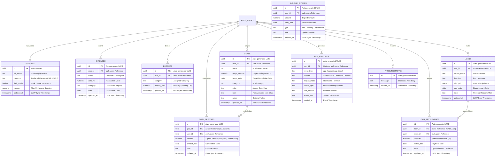

<div align="center">

# 💎 Ledgio

### Intelligent, Private, Offline-First Financial Ledger

*A visual financial ledger engineered for speed, privacy, and seamless multi-device budgeting.*

<br/>

[](LICENSE)
[](https://github.com/Code-Breaker-Ctrl/Ledgio)
[](https://supabase.com)
[](https://code-breaker-ctrl.github.io/Ledgio/)
[](https://code-breaker-ctrl.github.io/Ledgio/)

<br/>

[](https://code-breaker-ctrl.github.io/Ledgio/)

<br/>

**[Features](#-key-features)** • **[Install](#-app-installation-guide)** • **[Architecture](#️-architecture--file-structure)** • **[Database](#️-database-design)** • **[Quick Start](#-quick-start)** • **[Tech Stack](#️-tech-stack)** • **[Roadmap](#️-roadmap)**

</div>

---

## ✨ Why Ledgio?

Ledgio isn't just another budgeting app — it's a **local-first vault** that works fully offline, syncs to your own Supabase account when you're online, with per-user data isolation enforced by Row Level Security. Glassmorphic 3D UI meets a carefully tested offline sync engine.

---

## 🌟 Key Features

<table>
<tr>
<td width="50%" valign="top">

### 🌌 3D Interactive UI
- **Scroll-Driven Ambient Mesh** — background lighting morphs across sections in light & dark mode
- **Glassmorphic Floating Cards & Tilt** — real-time perspective transforms on cursor/touch
- **Zero-Flicker Theme Engine** — theme applies in `<head>` before paint, no white flash

</td>
<td width="50%" valign="top">

### 📱 100% Offline-First PWA
- **Multi-Platform Install** — Windows, macOS, Android, iOS home screens
- **Sub-Second Offline Launches** — Service Worker (`sw.js`) caches every asset
- **Smart Install Fallback** — one-tap on Chrome/Edge/Android, guided steps for iOS Safari, Mi/Oppo, and in-app webviews
- **Background Updater** — floating pill notifies of updates, zero-downtime refresh

</td>
</tr>
<tr>
<td width="50%" valign="top">

### ⚡ Offline-First Sync Engine
- **0ms Optimistic Mutations** — instant local UI, no waiting on the network
- **Persistent FIFO Mutation Queue** — queues writes while offline/disconnected
- **Exponential Backoff Replay** — auto-replays the queue once reconnected
- **Smart Error Handling** — network drops wait without counting as failures; server rejections dead-letter after 5 tries, transient 5xx/429 after 10
- **Per-Record Last-Write-Wins** — deterministic, timestamp-based conflict resolution
- **Dead-Letter Recovery** — isolates poison-pill mutations without blocking the queue
- **Cross-Tab Live Sync** — `BroadcastChannel` keeps every open tab in sync
- **Sync Diagnostics Hub** — live status pill + on-demand force-sync
- **Reset Tombstones** — clean resets/wipes propagate safely across offline caches

</td>
<td width="50%" valign="top">

### 🔐 Private Vault & Security
- **4-Digit PIN Lock** — a device-level convenience lock (salted SHA-256 hash, 5-attempt 30-second cooldown held in memory). It keeps casual onlookers out; it is not encryption of your data.
- **WebAuthn Biometric Unlock** — Touch ID, Face ID, fingerprint, Windows Hello
- **Inactivity Auto-Lock** — Immediate / 1 / 3 / 5 / 15 min / Never
- **Stealth Balance Masking** — 1-click navbar toggle and double-click card gesture mask amounts (`••••••`) and percentages (`••%`)
- **User-Safe Error Shielding (SEC-01)** — `mapErrorToUserMessage` sanitizes technical database errors for end users
- **Vault PIN Escape Hatch** — secure emergency recovery without corrupting your records

</td>
</tr>
<tr>
<td width="50%" valign="top">

### 💎 Net Worth Hero Card
- **Real-Time Aggregate Equation** — computed dynamically: `(Income − Expenses) + Total Lent − Total Borrowed`
- **Dynamic Glassmorphic Card** — emerald accent for positive net worth ($\ge 0$), rose accent for negative net worth ($< 0$)
- **Mobile Icon-Led Breakdown** — 3-column equal flex chips with tinted badges (`fa-coins`, `fa-hand-holding-dollar`, `fa-file-invoice-dollar`) and accessible `aria-label`s; zero overflow down to 320px
- **Desktop Breakdown Mode** — full text labels with bullet dot separators for viewports $\ge 1024\text{px}$
- **Double-Click Privacy Toggle** — double-clicking the hero card toggles stealth masking across all figures
- **Cross-Tab Recalculation** — updates live upon any ledger entry, budget change, or debt settlement

</td>
<td width="50%" valign="top">

### 🎯 Savings Goals & Milestones
- **Target Buckets** — goals with amounts, dates, custom icons & accent colors
- **First-Class Deposit/Withdraw Ledger** — additive `goal_deposits` keep math conflict-free across devices; balances are always computed, never stored
- **Visual Milestones** — progress bars, days-remaining badges, filter pills (All / In Progress / Completed)
- **Completion Celebration** — confetti animation at 100% funded 🎉

</td>
</tr>
<tr>
<td width="50%" valign="top">

### 🤝 Loans & Debts
- **Person-Centric Settle-Up Ledger** — tracks money lent to and borrowed from contacts without mixing into the expense ledger
- **Lent & Borrowed Directions** — real-time net position per person (`They owe you`, `You owe them`, `All settled up`)
- **First-Class Additive Settlements** — partial payments logged as discrete records; outstanding balances are strictly computed, never stored
- **One-Tap Write-Offs** — quick write-off action populates remaining balance with an automated "Written off" note
- **Settle-Up Celebration** — 60fps canvas confetti explosion upon reaching 100% full settlement 🎉
- **Batch Person Rename** — updates contact name across all associated active and settled loans

</td>
<td width="50%" valign="top">

### 🛡️ Admin System & Announcements
- **Role-Based Admin Protection** — hardcoded admin UUID identification (`window.LEDGIO_ADMIN_USER_IDS`) with profile chip badge
- **User-Safe Error Tiering** — `mapErrorToUserMessage` guarantees reassuring, zero-jargon messages for standard users while preserving deep technical diagnostics for admins
- **In-App Broadcast Announcements** — single "📣 Admin" attributed banner with 7-day auto-expiry and dismissal persistence
- **Gated Growth Telemetry (SEC-04)** — privacy-first install, launch, and platform metrics with database RLS restricting queries strictly to authorized admins

</td>
</tr>
<tr>
<td width="50%" valign="top">

### 🔑 Authentication & Identity
- **Flexible Providers** — Email/Password + one-click Google & GitHub OAuth
- **Multi-Provider Linking** — Supabase unifies logins sharing the same email
- **Persistent Sticky Sessions** — stays signed in across restarts & offline launches
- **Self-Service Credentials** — built-in email/password update flows

</td>
<td width="50%" valign="top">

### 🏷️ Custom Categories & Budgets
- **Custom Category Manager** — create custom categories with color-coded FontAwesome icon picker
- **Safe Expense Reassignment** — deleting a category triggers an intelligent reassign modal to prevent orphaned expenses
- **Integrity Safeguards** — minimum 1-category floor guard and 1-click "Restore Defaults" recovery
- **Visual Category Caps** — set monthly limits per category with real-time threshold progress bars and overspend alerts

</td>
</tr>
</table>

### 📊 Financial Ledger, Multi-Currency & Analytics

| | |
|---|---|
| 💱 **12 Live Currencies** | Real-time exchange rates, synced daily with cached offline fallback — `₹` `$` `€` `£` `د.إ` `S$` `CA$` `A$` `¥` `﷼` `৳` `रू` |
| 📱 **Touch-Optimized Ledger** | Responsive stacked cards, 46px touch targets, search, category chips |
| 📈 **2×2 Stat Grids** | Income, Expenses, Remaining Balance, Savings Rate with visual spend caps |
| 📉 **Interactive Analytics** | 6-month spending trends, category breakdowns, month stepper navigation, 1-click CSV/JSON export |

---

## 📲 App Installation Guide

<div align="center">

| 💻 Desktop (Windows / Mac) | 📱 Mobile (Android / iOS / Mi / WebViews) |
|:---|:---|
| 1️⃣ Open Ledgio in Chrome or Edge | 1️⃣ **Android** — tap **Install App** or Menu (⋮) |
| 2️⃣ Click **Install App** | 2️⃣ **iOS Safari** — tap Share (⬆) → **Add to Home Screen** |
| 3️⃣ Launch from Desktop / Taskbar | 3️⃣ **Webviews** — tap (⋮) → **Open in Chrome** |

</div>

---

## 🗄️ Database Design


```mermaid
erDiagram
    AUTH_USERS ||--|| PROFILES : "has profile"
    AUTH_USERS ||--o{ EXPENSES : "records"
    AUTH_USERS ||--o{ BUDGETS : "defines"
    AUTH_USERS ||--o{ GOALS : "targets"
    AUTH_USERS ||--o{ GOAL_DEPOSITS : "contributes"
    GOALS ||--o{ GOAL_DEPOSITS : "tracks ledger"
    AUTH_USERS ||--o{ LOANS : "tracks"
    AUTH_USERS ||--o{ LOAN_SETTLEMENTS : "settles"
    LOANS ||--o{ LOAN_SETTLEMENTS : "records history"
    AUTH_USERS ||--o{ APP_ANALYTICS : "generates"
    AUTH_USERS ||--o{ ANNOUNCEMENTS : "receives"

    ANNOUNCEMENTS {
        uuid id PK "Auto-generated UUID"
        text message "Broadcast Alert Body"
        timestamp created_at "Publication Timestamp"
    }

    PROFILES {
        uuid id PK "auth.users FK"
        text full_name "User Display Name"
        text currency "Preferred Currency (INR, USD...)"
        boolean dark_mode "Dark Theme Preference"
        numeric income "Monthly Income Baseline"
        timestamp updated_at "LWW Sync Timestamp"
    }

    EXPENSES {
        uuid id PK "Auto-generated UUID"
        uuid user_id FK "auth.users Reference"
        text name "Merchant / Description"
        numeric amount "Transaction Value"
        text category "Classified Category"
        date date "Transaction Date"
        timestamp updated_at "LWW Sync Timestamp"
    }

    BUDGETS {
        uuid id PK "Auto-generated UUID"
        uuid user_id FK "auth.users Reference"
        text category "Assigned Category"
        numeric monthly_limit "Monthly Spending Cap"
        timestamp updated_at "LWW Sync Timestamp"
    }

    GOALS {
        uuid id PK "Auto-generated UUID"
        uuid user_id FK "auth.users Reference"
        text name "Goal Target Name"
        numeric target_amount "Target Savings Amount"
        date target_date "Target Completion Date"
        text category "Goal Category"
        text color "Accent Color Hex"
        text icon "FontAwesome Icon Class"
        text notes "Optional Notes"
        timestamp updated_at "LWW Sync Timestamp"
    }

    GOAL_DEPOSITS {
        uuid id PK "Auto-generated UUID"
        uuid goal_id FK "goals Reference (CASCADE)"
        uuid user_id FK "auth.users Reference"
        numeric amount "Signed Amount (+Deposit, -Withdrawal)"
        date deposit_date "Contribution Date"
        text note "Optional Memo"
        timestamp updated_at "LWW Sync Timestamp"
    }

    LOANS {
        uuid id PK "Auto-generated UUID"
        uuid user_id FK "auth.users Reference"
        text person_name "Contact Name"
        text direction "lent / borrowed"
        numeric principal "Loan Principal (>0)"
        date loan_date "Disbursement Date"
        text notes "Optional Reason / Memo"
        timestamp updated_at "LWW Sync Timestamp"
    }

    LOAN_SETTLEMENTS {
        uuid id PK "Auto-generated UUID"
        uuid loan_id FK "loans Reference (CASCADE)"
        uuid user_id FK "auth.users Reference"
        numeric amount "Settlement Amount (>0)"
        date settle_date "Payment Date"
        text note "Optional Memo / Write-off"
        timestamp updated_at "LWW Sync Timestamp"
    }

    APP_ANALYTICS {
        uuid id PK "Auto-generated UUID"
        uuid user_id FK "Optional auth.users Reference"
        text event_type "app_launch / app_install"
        text platform "Android / iOS / Windows / macOS"
        text display_mode "standalone / browser"
        text device_type "mobile / desktop / tablet"
        text app_version "Release Version"
        text screen_res "Screen Dimensions"
        timestamp created_at "Event Timestamp"
    }

    INCOME_ENTRIES {
        uuid id PK "Auto-generated UUID"
        uuid user_id FK "auth.users Reference"
        numeric amount "Signed Amount"
        date entry_date "Transaction Date"
        text type "add / opening / adjustment"
        text note "Optional Memo"
        timestamp updated_at "LWW Sync Timestamp"
    }
```

> 🔒 **Every table is RLS-isolated per user.** Deposits and settlements are first-class records — goal and loan balances are always *computed*, never stored.

<details>
<summary><b>📋 Table Specifications & Security Policies</b></summary>

| Table | Purpose | Security Policy (RLS) |
| :--- | :--- | :--- |
| **`profiles`** | Identity, avatar name, theme, income baseline, currency preferences | Restricted to `auth.uid() = id` |
| **`expenses`** | Transaction records, category mappings, dates, amounts, LWW timestamps | Isolated per account (`auth.uid() = user_id`) |
| **`budgets`** | Monthly spending limits and category allocations | Unique per `(user_id, category)` |
| **`goals`** | Target savings buckets — metadata & targets only, balance computed from deposits | Isolated per account (`auth.uid() = user_id`) |
| **`goal_deposits`** | First-class signed ledger records (`+` deposit, `-` withdrawal) | Cascades with parent goal, isolated to `auth.uid() = user_id` |
| **`loans`** | People-centric debt ledger — metadata & principal only, outstanding computed from settlements | Isolated per account (`auth.uid() = user_id`) |
| **`loan_settlements`** | Additive settlement records validating `amount <= outstanding` | Cascades with parent loan, isolated to `auth.uid() = user_id` |
| **`app_analytics`** | Privacy-first install/launch telemetry | Permissive client INSERT; SELECT restricted strictly to Admin UUID via RLS (SEC-04); length and event-type CHECK constraints (phase5d) |
| **`announcements`** | System-wide broadcast alerts displayed in-app | SELECT allowed for all authenticated users; INSERT restricted strictly to Admin UUID via RLS |
| **`income_entries`** | Dated ledger of income events (`add`, `opening`, `adjustment`) | Isolated per account (`auth.uid() = user_id`) |

</details>

---

## 🏗️ Architecture & File Structure

<details>
<summary><b>📂 Click to expand full project tree</b></summary>

```
Ledgio/
├── .github/
│   └── workflows/
│       └── runtime-gate.yml          # GitHub Actions CI Workflow for Automated Runtime Regression Gates
│
├── assets/
│   ├── css/
│   │   ├── styles.css                # 3D Design Tokens, Mesh Lighting & Theme CSS
│   │   ├── styles.min.css            # Production Minified Theme Styles
│   │   ├── dashboard.css             # Dashboard Grid, Badges & Mobile Responsive CSS
│   │   └── dashboard.min.css         # Production Minified Dashboard Styles
│   ├── js/
│   │   ├── app.js                    # Core Financial Engine, Vault & State (Unminified)
│   │   ├── app.min.js                # Production Minified Financial Engine
│   │   ├── auth.js                   # Supabase Auth & OAuth Handlers (Unminified)
│   │   ├── auth.min.js               # Production Minified Auth Module
│   │   ├── pwa-installer.js          # PWA Install Prompts, Diagnostics & Device Fallback
│   │   ├── pwa-installer.min.js      # Production Minified PWA Engine
│   │   ├── supabase-config.js        # Cloud Database Client Configuration
│   │   └── supabase-config.min.js    # Production Minified Database Client Config
│   └── icons/
│       ├── favicon.png               # Browser Tab Icon (32x32)
│       ├── apple-touch-icon.png      # iOS Safari Web Clip Icon (180x180)
│       ├── icon-192.png              # App Launcher Icon (192x192)
│       ├── icon-512.png              # High-Res Launcher Icon (512x512)
│       └── icon-maskable-512.png     # Adaptive Maskable Android Icon (512x512)
│
├── backend/
│   ├── migrations/
│   │   ├── phase3_offline_sync.sql   # Offline-first sync engine & LWW triggers
│   │   ├── phase4_savings_goals.sql  # Savings goals & first-class deposits DDL
│   │   ├── phase5_loans.sql          # Loans & debt settlements ledger DDL
│   │   ├── phase5b_announcements.sql # System announcements & admin broadcast DDL
│   │   ├── phase5c_analytics_rls.sql # Telemetry RLS lockdown to Admin UUID (SEC-04)
│   │   ├── phase5d_analytics_hardening.sql # Length + event-type CHECK constraints on app_analytics (SEC-05)
│   │   └── phase6_income_entries.sql # Dated income events ledger & opening balance backfill
│   ├── README.md                     # Database Architecture & Deployment Guide
│   ├── supabase-schema.sql           # Base PostgreSQL DDL, RLS Policies & Triggers
│   ├── verify_schema_phase4.sql      # Schema & FK verification script (Goals)
│   └── verify_schema_phase5.sql      # Schema & FK verification script (Loans)
│
├── scripts/
│   ├── build.ps1                     # Automated UTF-8 Asset Minifier (auto-bumps SW cache)
│   ├── capture_loan_screenshots.ps1  # Automated multi-viewport screenshot capture utility
│   └── test_runtime_gate.ps1         # Headless Browser Runtime Regression Suite (134 checks)
│
├── tests/
│   ├── headless_regression.html      # Interactive in-browser DOM assertion harness (22 gates)
│   └── screenshot_loans.html         # Visual test harness for multi-resolution loan card rendering
│
├── .gitignore                        # Git Exclusion Rules & Secrets Shield
├── README.md                         # Comprehensive Project Documentation
├── index.html                        # 3D SaaS Landing Page & Live Budget Simulator
├── dashboard.html                    # Core Financial Application (7 Modular Views)
├── login.html                        # Split-Screen Responsive Login Portal (OAuth Enabled)
├── signup.html                       # Split-Screen Responsive Signup Portal (OAuth Enabled)
├── manifest.json                     # PWA Web App Manifest, Shortcuts & Configuration
└── sw.js                             # Root-Scoped Offline Service Worker (version auto-bumps per build)
```

</details>

---

## 🚀 Quick Start

**1. Clone the repository**
```bash
git clone https://github.com/Code-Breaker-Ctrl/Ledgio.git
cd Ledgio
```

**2. Run database migrations**

In your [Supabase SQL Editor](https://supabase.com/dashboard), run these **in order** before enabling cloud sync:

| Step | File | Purpose |
|:---:|---|---|
| 1 | `backend/supabase-schema.sql` | Base schema & RLS policies |
| 2 | `backend/migrations/phase3_offline_sync.sql` | LWW timestamp triggers & offline engine |
| 3 | `backend/migrations/phase4_savings_goals.sql` | Goals & goal-deposits ledger |
| 4 | `backend/migrations/phase5_loans.sql` | Loans & debt settlements ledger |
| 5 | `backend/migrations/phase5b_announcements.sql` | System announcements & admin broadcast DDL |
| 6 | `backend/migrations/phase5c_analytics_rls.sql` | Telemetry RLS lockdown to Admin UUID (SEC-04) |
| 7 | `backend/migrations/phase5d_analytics_hardening.sql` | Length + event-type CHECK constraints on app_analytics (SEC-05) |
| 8 | `backend/migrations/phase6_income_entries.sql` | Dated income events ledger & opening balance backfill |
| ✓ *optional* | `backend/verify_schema_phase4.sql` | Assert schema validity (Goals) |
| ✓ *optional* | `backend/verify_schema_phase5.sql` | Assert schema validity (Loans) |

**3. Configure Supabase & OAuth**

Open `assets/js/supabase-config.js` and set your project credentials:
```javascript
window.SUPABASE_CONFIG = {
  url: 'https://your-project.supabase.co',
  anonKey: 'your-anon-public-key'
};
// Optional: authorized administrative user UUIDs
window.LEDGIO_ADMIN_USER_IDS = ['your-admin-uuid-here'];
```
> In **Supabase Dashboard → Authentication → URL Configuration**, set the Site URL to your domain (e.g. `https://<username>.github.io/Ledgio/`) and add redirect URLs for `/dashboard.html`, `/`, and `/login.html`. Then enable Google and/or GitHub under **Authentication → Providers**.

**4. Launch the application**
```bash
# Quick local launch with Python
python -m http.server 8000
```
Open `http://localhost:8000` in your browser. 🎉

---

## 🛠️ Tech Stack

| Layer | Technology |
|---|---|
| **Frontend** | Vanilla JavaScript (ES6+), HTML5, CSS3 Glassmorphism, IntersectionObserver, `content-visibility` |
| **PWA & Offline** | Service Worker API (`sw.js`), Web App Manifest, `BroadcastChannel` API |
| **Security & Hardware** | WebAuthn API (`PublicKeyCredential`), Web Crypto API (SHA-256 salted PIN hashing) |
| **Database & Auth** | [Supabase](https://supabase.com) — PostgreSQL 15, Row Level Security, GoTrue Auth (Email + Google/GitHub OAuth) |
| **Charts & Visuals** | [Chart.js](https://www.chartjs.org/), Canvas Confetti |
| **Icons & Typography** | Font Awesome 6, Plus Jakarta Sans, Space Grotesk |
| **Testing & QA** | Headless Edge/Chrome regression suite — 134 interactive DOM assertions across 22 test gates (`scripts/test_runtime_gate.ps1`, GitHub Actions CI) |

---

## 🗺️ Roadmap

- [ ] 🗓️ **Month-Cycle Planner (v1.5)** — custom pay-cycle tracking and rollover budgeting
- [ ] 📄 **PDF Financial Statements** — exportable monthly and annual financial statements
- [ ] 📦 **TWA / Play Store Packaging** — mobile wrapper with native `BiometricPrompt` bridge

---

## 📄 License

Licensed under the **MIT License** — free for personal and commercial use.

<div align="center">

<br/>

[](https://github.com/Code-Breaker-Ctrl/Ledgio)

**[Live Demo](https://code-breaker-ctrl.github.io/Ledgio/)** &nbsp;•&nbsp; **[Report an Issue](https://github.com/Code-Breaker-Ctrl/Ledgio/issues)** &nbsp;•&nbsp; **[Code-Breaker-Ctrl](https://github.com/Code-Breaker-Ctrl)**

</div>
