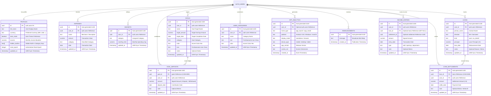

<div align="center">

# 💎 Ledgio

### Intelligent, Private, Offline-First Financial Ledger

*A visual financial ledger engineered for speed, privacy, and seamless multi-device budgeting.*

<br/>

[](LICENSE)
[](https://github.com/Code-Breaker-Ctrl/Ledgio)
[](https://supabase.com)
[](https://code-breaker-ctrl.github.io/Ledgio/)
[](https://code-breaker-ctrl.github.io/Ledgio/)

<br/>

[](https://code-breaker-ctrl.github.io/Ledgio/)

<br/>

**[Features](#-key-features)** • **[Install](#-app-installation-guide)** • **[Architecture](#️-architecture--file-structure)** • **[Database](#️-database-design)** • **[Developer & Build](#-developer-guide--build-pipeline)** • **[Quick Start](#-quick-start)** • **[Tech Stack](#️-tech-stack)** • **[Roadmap](#️-roadmap)**

</div>

---

## ✨ Why Ledgio?

Ledgio isn't just another budgeting app — it's a **local-first vault** that works fully offline, syncs to your own Supabase account when you're online, with per-user data isolation enforced by Row Level Security. Glassmorphic 3D UI meets a carefully tested offline sync engine.

---

## 🌟 Key Features

<table>
<tr>
<td width="50%" valign="top">

### 🌌 3D Interactive UI
- **Scroll-Driven Ambient Mesh** — background lighting morphs across sections in light & dark mode
- **Glassmorphic Floating Cards & Tilt** — real-time perspective transforms on cursor/touch
- **Zero-Flicker Theme Engine** — theme applies in `<head>` before paint, no white flash

</td>
<td width="50%" valign="top">

### 📱 100% Offline-First PWA
- **Multi-Platform Install** — Windows, macOS, Android, iOS home screens
- **Sub-Second Offline Launches** — Service Worker (`sw.js`) caches every asset
- **Smart Install Fallback** — one-tap on Chrome/Edge/Android, guided steps for iOS Safari, Mi/Oppo, and in-app webviews
- **Background Updater** — floating pill notifies of updates, zero-downtime refresh

</td>
</tr>
<tr>
<td width="50%" valign="top">

### ⚡ Offline-First Sync Engine
- **Stage 0 Unconditional Enqueue** — all mutations persist to local storage and queue (`sync-engine.js`) before network sync
- **0ms Optimistic Mutations** — instant local UI, no waiting on the network
- **Persistent FIFO Mutation Queue** — queues writes while offline/disconnected
- **Exponential Backoff Replay** — auto-replays the queue once reconnected (`[3s, 6s, 12s, 30s, 60s]`)
- **Smart Error Handling** — network drops wait without counting as failures; server rejections dead-letter after 5 tries, transient 5xx/429 after 10
- **Per-Record Last-Write-Wins** — deterministic, timestamp-based conflict resolution
- **Dead-Letter Recovery (DLQ)** — isolates poison-pill mutations without blocking the queue
- **Cross-Tab Live Sync** — `BroadcastChannel` keeps every open tab in sync
- **Sync Diagnostics Hub** — live status pill + on-demand force-sync
- **Reset Tombstones & Epochs** — clean resets/wipes propagate safely across multi-device offline caches

</td>
<td width="50%" valign="top">

### 🔐 Private Vault & Security
- **Modular Vault Engine (`vault.js`)** — standalone device security and privacy engine
- **4-Digit PIN Lock** — a device-level convenience lock (salted PBKDF2/SHA-256 hash, 5-attempt 30-second cooldown held in memory). It keeps casual onlookers out; it is not encryption of your data.
- **WebAuthn Biometric Unlock** — Touch ID, Face ID, fingerprint, Windows Hello platform authenticator
- **Inactivity & Visibility Auto-Lock** — Immediate / 1 / 3 / 5 / 15 min / Never and instant background tab auto-lock
- **Stealth Balance Masking** — 1-click navbar toggle and double-click card gesture mask amounts (`••••••`) and percentages (`••%`) across net worth, stat cards, expenses, leftover prompts, and loan modals
- **User-Safe Error Shielding (SEC-01)** — `mapErrorToUserMessage` sanitizes technical database errors for end users
- **Vault PIN Escape Hatch** — emergency PIN reset and force logout without corrupting underlying records

</td>
</tr>
<tr>
<td width="50%" valign="top">

### 💎 Net Worth Hero Card
- **Real-Time Aggregate Equation** — computed dynamically: `(Income − Expenses) + Total Lent − Total Borrowed`
- **Dynamic Glassmorphic Card** — emerald accent for positive net worth ($\ge 0$), rose accent for negative net worth ($< 0$)
- **Mobile Icon-Led Breakdown** — 3-column equal flex chips with tinted badges (`fa-coins`, `fa-hand-holding-dollar`, `fa-file-invoice-dollar`) and accessible `aria-label`s; zero overflow down to 320px
- **Desktop Breakdown Mode** — full text labels with bullet dot separators for viewports $\ge 1024\text{px}$
- **Double-Click Privacy Toggle** — double-clicking the hero card toggles stealth masking across all figures
- **Cross-Tab Recalculation** — updates live upon any ledger entry, budget change, or debt settlement

</td>
<td width="50%" valign="top">

### 🎯 Savings Goals & Milestones
- **Modular Goals Domain (`goals.js`)** — dedicated goals and deposits engine with child-first cascade delete ordering
- **Target Buckets** — goals with amounts, dates, custom icons & accent colors
- **First-Class Deposit/Withdraw Ledger** — additive `goal_deposits` keep math conflict-free across devices; balances are always computed, never stored
- **Visual Milestones** — progress bars, days-remaining badges, filter pills (All / In Progress / Completed)
- **Completion Celebration** — confetti animation at 100% funded 🎉

</td>
</tr>
<tr>
<td width="50%" valign="top">

### 🤝 Loans & Debts
- **Modular Loans Domain (`loans.js`)** — isolated loan state, calculators, and modals with accounting integrity guarantees
- **Dual Loan Kinds** — `cash` (double-entry wallet balance impact on borrow/repay) and `on_behalf` ("Paid for me" / "Paid on behalf", zero initial cashflow, honest Net Worth impact)
- **Zero Cash-Flow on Cash Write-Offs** — writing off a cash loan settles outstanding to 0 with zero cash adjustment in `income_entries` (no phantom inflows or false deductions)
- **Ledger-Synchronized Edits & Deletions** — editing principal updates opening adjustments; deleting unsettled cash loans cleans up opening adjustments (with 5s undo restore)
- **Strict Accounting Guards** — editing principal below settled amount is blocked; integer-cents precision blocks fractional overpayment
- **Additive Settlements** — discrete settlement ledger records; balances are strictly computed, never stored
- **Stealth Privacy Masking** — principal, outstanding balance, settlement amounts, and loan history masked in stealth mode
- **Settle-Up Celebration** — 60fps canvas confetti explosion upon reaching 100% full settlement 🎉
- **Batch Person Rename** — updates contact name across all associated active and settled loans

</td>
<td width="50%" valign="top">

### 🛡️ Admin System & Announcements
- **Role-Based Admin Protection** — hardcoded admin UUID identification (`window.LEDGIO_ADMIN_USER_IDS`) with profile chip badge
- **User-Safe Error Tiering** — `mapErrorToUserMessage` guarantees reassuring, zero-jargon messages for standard users while preserving deep technical diagnostics for admins
- **In-App Broadcast Announcements** — single "📣 Admin" attributed banner with 7-day auto-expiry and dismissal persistence
- **Gated Growth Telemetry (SEC-04)** — privacy-first install, launch, and platform metrics with database RLS restricting queries strictly to authorized admins

</td>
</tr>
<tr>
<td width="50%" valign="top">

### 🔑 Authentication & Identity
- **Flexible Providers** — Email/Password + one-click Google & GitHub OAuth
- **Supabase Client Singleton Factory** — `window.getSupabaseClient()` serves as the single instance origin, preventing multi-instance locks and coordination blips
- **Hardened Auth State (`onAuthStateChange`)** — preserves financial state and caches across token refreshes and user profile updates
- **Transient `SIGNED_OUT` Shield** — distinguishes temporary network disconnects or token blips from explicit user logout (never purges local caches on transient blip)
- **Pre-Logout Safety Guard** — inspects pending sync queues and unsynced changes before logout, prompting with safety confirmations
- **Multi-Provider Linking** — Supabase unifies logins sharing the same email
- **Persistent Sticky Sessions** — stays signed in across restarts & offline launches
- **Self-Service Credentials** — built-in email/password update flows

</td>
<td width="50%" valign="top">

### 🏷️ Custom Categories & Budgets
- **Modular Domain (`categories.js` & `expenses.js`)** — separated category metadata, expense tracking, and budget evaluations
- **Custom Category Manager** — create custom categories with color-coded FontAwesome icon picker
- **Cloud Roaming Category Cache** — `user_categories` table and profile hidden-builtins persist custom categories across devices with 0ms Phase 1 paint
- **Safe Expense Reassignment** — deleting a category triggers an intelligent reassign modal to prevent orphaned expenses
- **Integrity Safeguards** — minimum 1-category floor guard and 1-click "Restore Defaults" recovery
- **Visual Category Caps & Alerts** — set monthly limits per category with 80% warning and 100% exceeded visual thresholds

</td>
</tr>
<tr>
<td width="50%" valign="top">

### 💵 Income Ledger & History
- **Modular Income Domain (`income.js`)** — dedicated income transactions ledger with RFC 1321 MD5 deterministic opening balance IDs
- **First-Class Dated Ledger** — dated entries (`add`, `opening`, `adjustment`) replace flat income baselines; computed dynamically via `SUM(amount)`
- **Monthly vs. Lifetime Visibility** — "Income — This Month" tracks current-month cashflow alongside muted "Lifetime" totals
- **Dynamic Spend Rate** — `<n>% of this month's income spent` with Low (green), Moderate (amber), and High (rose) alerts + stealth masking
- **Adjustment Delta Previews** — live feedback displays exact signed adjustment delta (`+₹X` / `−₹X`) before committing balance changes
- **Collapsible Chronological History** — month-grouped transactions with type badges and delete guards safeguarding opening balances

</td>
<td width="50%" valign="top">

### 💡 Leftover Funds Quick Action
- **One-Tap Goal Funding Prompt** — when Remaining $> 0$, prompts: *"Add ₹X leftover to a goal?"* directly on the Remaining stat card
- **Goal Picker Integration** — select any active savings goal to instantly deposit leftover funds and record companion savings expenses
- **Zero-Goal Auto Creation** — if no goals exist, opens Goal Creator with prefilled leftover target to start progress immediately
- **Monthly Dismissal Memory** — dismissible per-month (`ledgio_leftover_dismissed_YYYY-MM`), automatically returning next month
- **Privacy-Aware Stealth Masking** — leftover amounts automatically conceal as `₹••••••` when Stealth Mode is toggled

</td>
</tr>
</table>

### 📊 Financial Ledger, Multi-Currency & Analytics

| | |
|---|---|
| 💱 **12 Live Currencies** | Real-time exchange rates, synced daily with cached offline fallback — `₹` `$` `€` `£` `د.إ` `S$` `CA$` `A$` `¥` `﷼` `৳` `रू` |
| 📱 **Touch-Optimized Ledger** | Responsive stacked cards, 46px touch targets, search, category chips |
| 📈 **2×2 Stat Grids** | Income, Expenses, Remaining Balance, Savings Rate with visual spend caps |
| 📉 **Interactive Analytics** | 6-month spending trends, category breakdowns, month stepper navigation, 1-click CSV/JSON export |

---

## 📲 App Installation Guide

<div align="center">

| 💻 Desktop (Windows / Mac) | 📱 Mobile (Android / iOS / Mi / WebViews) |
|:---|:---|
| 1️⃣ Open Ledgio in Chrome or Edge | 1️⃣ **Android** — tap **Install App** or Menu (⋮) |
| 2️⃣ Click **Install App** | 2️⃣ **iOS Safari** — tap Share (⬆) → **Add to Home Screen** |
| 3️⃣ Launch from Desktop / Taskbar | 3️⃣ **Webviews** — tap (⋮) → **Open in Chrome** |

</div>

---

## 🗄️ Database Design


```mermaid
erDiagram
    AUTH_USERS ||--|| PROFILES : "has profile"
    AUTH_USERS ||--o{ EXPENSES : "records"
    AUTH_USERS ||--o{ BUDGETS : "defines"
    AUTH_USERS ||--o{ GOALS : "targets"
    AUTH_USERS ||--o{ GOAL_DEPOSITS : "contributes"
    GOALS ||--o{ GOAL_DEPOSITS : "tracks ledger"
    AUTH_USERS ||--o{ LOANS : "tracks"
    AUTH_USERS ||--o{ LOAN_SETTLEMENTS : "settles"
    LOANS ||--o{ LOAN_SETTLEMENTS : "records history"
    AUTH_USERS ||--o{ USER_CATEGORIES : "customizes"
    AUTH_USERS ||--o{ APP_ANALYTICS : "generates"
    AUTH_USERS ||--o{ ANNOUNCEMENTS : "receives"
    AUTH_USERS ||--o{ INCOME_ENTRIES : "tracks income"

    ANNOUNCEMENTS {
        uuid id PK "Auto-generated UUID"
        text message "Broadcast Alert Body"
        timestamp created_at "Publication Timestamp"
    }

    PROFILES {
        uuid id PK "auth.users FK"
        text full_name "User Display Name"
        text currency "Preferred Currency (INR, USD...)"
        boolean dark_mode "Dark Theme Preference"
        numeric income "Monthly Income Baseline"
        text[] hidden_builtins "Hidden Built-in Category Keys"
        integer reset_epoch "Authoritative Reset Epoch"
        timestamp updated_at "LWW Sync Timestamp"
    }

    EXPENSES {
        uuid id PK "Auto-generated UUID"
        uuid user_id FK "auth.users Reference"
        text name "Merchant / Description"
        numeric amount "Transaction Value"
        text category "Classified Category"
        date date "Transaction Date"
        timestamp updated_at "LWW Sync Timestamp"
    }

    BUDGETS {
        uuid id PK "Auto-generated UUID"
        uuid user_id FK "auth.users Reference"
        text category "Assigned Category"
        numeric monthly_limit "Monthly Spending Cap"
        timestamp updated_at "LWW Sync Timestamp"
    }

    GOALS {
        uuid id PK "Auto-generated UUID"
        uuid user_id FK "auth.users Reference"
        text name "Goal Target Name"
        numeric target_amount "Target Savings Amount"
        date target_date "Target Completion Date"
        text category "Goal Category"
        text color "Accent Color Hex"
        text icon "FontAwesome Icon Class"
        text notes "Optional Notes"
        timestamp updated_at "LWW Sync Timestamp"
    }

    GOAL_DEPOSITS {
        uuid id PK "Auto-generated UUID"
        uuid goal_id FK "goals Reference (CASCADE)"
        uuid user_id FK "auth.users Reference"
        numeric amount "Signed Amount (+Deposit, -Withdrawal)"
        date deposit_date "Contribution Date"
        text note "Optional Memo"
        timestamp updated_at "LWW Sync Timestamp"
    }

    LOANS {
        uuid id PK "Auto-generated UUID"
        uuid user_id FK "auth.users Reference"
        text person_name "Contact Name"
        text direction "lent / borrowed"
        text kind "cash / on_behalf"
        numeric principal "Loan Principal (>0)"
        date loan_date "Disbursement Date"
        text notes "Optional Reason / Memo"
        timestamp updated_at "LWW Sync Timestamp"
    }

    LOAN_SETTLEMENTS {
        uuid id PK "Auto-generated UUID"
        uuid loan_id FK "loans Reference (CASCADE)"
        uuid user_id FK "auth.users Reference"
        numeric amount "Settlement Amount (>0)"
        date settle_date "Payment Date"
        text note "Optional Memo / Write-off"
        timestamp updated_at "LWW Sync Timestamp"
    }

    USER_CATEGORIES {
        uuid id PK "Auto-generated UUID"
        uuid user_id FK "auth.users Reference"
        text name "Category Name"
        text icon "FontAwesome Icon Class"
        text color "Accent Color Hex"
        timestamp updated_at "LWW Sync Timestamp"
    }

    APP_ANALYTICS {
        uuid id PK "Auto-generated UUID"
        uuid user_id FK "Optional auth.users Reference"
        text event_type "app_launch / app_install"
        text platform "Android / iOS / Windows / macOS"
        text display_mode "standalone / browser"
        text device_type "mobile / desktop / tablet"
        text app_version "Release Version"
        text screen_res "Screen Dimensions"
        timestamp created_at "Event Timestamp"
    }

    INCOME_ENTRIES {
        uuid id PK "Auto-generated UUID"
        uuid user_id FK "auth.users Reference"
        uuid loan_id FK "Optional loans Reference (SET NULL)"
        uuid settlement_id "Optional settlement Reference UUID"
        numeric amount "Signed Amount"
        date entry_date "Transaction Date"
        text type "add / opening / adjustment"
        text note "Optional Memo"
        timestamp updated_at "LWW Sync Timestamp"
    }
```

> 🔒 **Every table is RLS-isolated per user.** Deposits and settlements are first-class records — goal and loan balances are always *computed*, never stored.

<details>
<summary><b>📋 Table Specifications & Security Policies</b></summary>

| Table | Purpose | Security Policy (RLS) |
| :--- | :--- | :--- |
| **`profiles`** | Identity, avatar name, theme, income baseline, currency preferences, hidden built-ins, reset epoch | Restricted to `auth.uid() = id` |
| **`expenses`** | Transaction records, category mappings, dates, amounts, LWW timestamps | Isolated per account (`auth.uid() = user_id`) |
| **`budgets`** | Monthly spending limits and category allocations | Unique per `(user_id, category)` |
| **`goals`** | Target savings buckets — metadata & targets only, balance computed from deposits | Isolated per account (`auth.uid() = user_id`) |
| **`goal_deposits`** | First-class signed ledger records (`+` deposit, `-` withdrawal) | Cascades with parent goal, isolated to `auth.uid() = user_id` |
| **`loans`** | People-centric debt ledger — metadata, kind (`cash`/`on_behalf`), & principal only; outstanding computed from settlements | Isolated per account (`auth.uid() = user_id`) |
| **`loan_settlements`** | Additive settlement records validating `amount <= outstanding` | Cascades with parent loan, isolated to `auth.uid() = user_id` |
| **`user_categories`** | Custom categories cloud backup (name, icon, color) | Unique per `(user_id, LOWER(name))`, isolated to `auth.uid() = user_id` |
| **`app_analytics`** | Privacy-first install/launch telemetry | Permissive client INSERT; SELECT restricted strictly to Admin UUID via RLS (SEC-04); length and event-type CHECK constraints (phase5d) |
| **`announcements`** | System-wide broadcast alerts displayed in-app | SELECT allowed for all authenticated users; INSERT restricted strictly to Admin UUID via RLS |
| **`income_entries`** | Dated ledger of income events (`add`, `opening`, `adjustment`) with double-entry loan linkage | Isolated per account (`auth.uid() = user_id`) |

</details>

---

## 🏗️ Architecture & File Structure

Ledgio utilizes an **offline-first modular domain architecture**. Core sub-domains formerly housed inside a monolithic `app.js` have been surgically extracted into independent, cohesive modules that communicate with the host application via explicit dependency injection bridges (`configure({ ... })`).

### 🧩 Domain Modules Overview

| Module | Namespace | Purpose & Guarantees |
| :--- | :--- | :--- |
| **`supabase-config.js`** | `SUPABASE_CONFIG` | Central credentials, authorized admin UUIDs, and the **singleton client factory** (`window.getSupabaseClient()`). |
| **`sync-engine.js`** | `LedgioSyncEngine` | Offline FIFO mutation queue, LWW conflict resolver, exponential backoff replay, and Dead-Letter Queue (DLQ). Enforces Stage 0 unconditional enqueuing. |
| **`loans.js`** | `LedgioLoans` | Loans & debt settlements ledger. Enforces dual loan kinds (`cash` vs `on_behalf`), zero cash-flow on cash write-offs, ledger-synced opening adjustments, and stealth masking. |
| **`income.js`** | `LedgioIncome` | Dated income ledger, RFC 1321 MD5 deterministic opening balance IDs, monthly vs. lifetime calculations, and balance adjustment delta previews. |
| **`goals.js`** | `LedgioGoals` | Target savings buckets, first-class additive deposits ledger, child-first cascade delete ordering, and celebration confetti. |
| **`categories.js`** | `LedgioCategories` | Built-in category metadata, custom categories CRUD, cloud roaming cache (`user_categories`), hidden built-ins, and safe reassignment. |
| **`expenses.js`** | `LedgioExpenses` | Expense CRUD, category monthly limits, 80%/100% warning threshold evaluations, and spend-by-category calculations. |
| **`vault.js`** | `LedgioVault` | Private vault lock screen, PBKDF2/SHA-256 salted PIN hash, WebAuthn biometric unlock, inactivity/visibility auto-lock, and stealth privacy masking. |
| **`pwa-installer.js`** | — | PWA installation prompts, beforeinstallprompt interceptor, and platform-specific fallback guides. |
| **`auth.js`** | — | Supabase Auth/OAuth handlers, persistent sessions, hardened `onAuthStateChange`, transient `SIGNED_OUT` shields, and pre-logout safety checks. |
| **`app.js`** | — | Application orchestration, 3-phase bootstrap sequence, Chart.js trends, header controls, modal routing, and UI glue. |

<details>
<summary><b>📂 Click to expand full project tree</b></summary>

```
Ledgio/
├── .github/
│   └── workflows/
│       └── runtime-gate.yml          # GitHub Actions CI Workflow for Automated Runtime Regression Gates
│
├── assets/
│   ├── css/
│   │   ├── styles.css                # 3D Design Tokens, Mesh Lighting & Theme CSS
│   │   ├── styles.min.css            # Production Minified Theme Styles
│   │   ├── dashboard.css             # Dashboard Grid, Badges & Mobile Responsive CSS
│   │   └── dashboard.min.css         # Production Minified Dashboard Styles
│   ├── js/
│   │   ├── app.js                    # Orchestration, Dashboard State, Charts & UI Glue
│   │   ├── app.min.js                # Production Minified Orchestration Engine
│   │   ├── auth.js                   # Session Management, OAuth & Hardened Auth State Handlers
│   │   ├── auth.min.js               # Production Minified Auth Module
│   │   ├── categories.js             # Built-in & Custom Categories, Cloud Roaming & Reassignment
│   │   ├── categories.min.js         # Production Minified Categories Domain
│   │   ├── expenses.js               # Expense CRUD, Category Budgets & Warning Thresholds
│   │   ├── expenses.min.js           # Production Minified Expenses Domain
│   │   ├── goals.js                  # Savings Goals, First-Class Deposits & Cascade Deletes
│   │   ├── goals.min.js              # Production Minified Goals Domain
│   │   ├── income.js                 # Income Ledger, Dated Entries & Deterministic Opening Balances
│   │   ├── income.min.js             # Production Minified Income Domain
│   │   ├── loans.js                  # Loans & Debt Settlements Ledger, Dual Kinds & Accounting Integrity
│   │   ├── loans.min.js              # Production Minified Loans Domain
│   │   ├── pwa-installer.js          # PWA Install Prompts, Diagnostics & Device Fallback
│   │   ├── pwa-installer.min.js      # Production Minified PWA Engine
│   │   ├── supabase-config.js        # Supabase Client Singleton Factory & Admin Configuration
│   │   ├── supabase-config.min.js    # Production Minified Database Client Config
│   │   ├── sync-engine.js            # Offline-First FIFO Mutation Queue, LWW Resolver & DLQ
│   │   ├── sync-engine.min.js        # Production Minified Sync Engine
│   │   ├── vault.js                  # Private Vault, PIN Salt/Hash, WebAuthn, Stealth & Auto-Lock
│   │   └── vault.min.js              # Production Minified Vault Domain
│   └── icons/
│       ├── favicon.png               # Browser Tab Icon (32x32)
│       ├── apple-touch-icon.png      # iOS Safari Web Clip Icon (180x180)
│       ├── icon-192.png              # App Launcher Icon (192x192)
│       ├── icon-512.png              # High-Res Launcher Icon (512x512)
│       └── icon-maskable-512.png     # Adaptive Maskable Android Icon (512x512)
│
├── backend/
│   ├── migrations/
│   │   ├── phase3_offline_sync.sql   # Offline-first sync engine & LWW triggers
│   │   ├── phase4_savings_goals.sql  # Savings goals & first-class deposits DDL
│   │   ├── phase5_loans.sql          # Loans & debt settlements ledger DDL
│   │   ├── phase5b_announcements.sql # System announcements & admin broadcast DDL
│   │   ├── phase5c_analytics_rls.sql # Telemetry RLS lockdown to Admin UUID (SEC-04)
│   │   ├── phase5d_analytics_hardening.sql # Length + event-type CHECK constraints on app_analytics (SEC-05)
│   │   ├── phase6_income_entries.sql # Dated income events ledger & opening balance backfill
│   │   ├── phase6b_loan_linked_income.sql # Loan & settlement foreign key references in income_entries
│   │   ├── phase7_categories.sql     # Custom categories cloud persistence & hidden built-ins DDL
│   │   ├── phase7b_reset_epoch.sql   # Multi-device reset epoch counter DDL
│   │   └── phase8_loan_kinds.sql     # Dual loan kinds schema (cash vs on_behalf)
│   ├── README.md                     # Database Architecture & Deployment Guide
│   ├── supabase-schema.sql           # Base PostgreSQL DDL, RLS Policies & Triggers
│   ├── verify_schema_phase4.sql      # Schema & FK verification script (Goals)
│   └── verify_schema_phase5.sql      # Schema & FK verification script (Loans)
│
├── scripts/
│   ├── build.ps1                     # Automated UTF-8 Asset Minifier (auto-bumps SW cache)
│   ├── capture_loan_screenshots.ps1  # Automated multi-viewport screenshot capture utility
│   └── test_runtime_gate.ps1         # Headless Browser Runtime Regression Suite (234 assertion gates)
│
├── tests/
│   ├── headless_regression.html      # Interactive in-browser DOM assertion harness (37 gate suites)
│   └── screenshot_loans.html         # Visual test harness for multi-resolution loan card rendering
│
├── .gitignore                        # Git Exclusion Rules & Secrets Shield
├── README.md                         # Comprehensive Project Documentation
├── index.html                        # 3D SaaS Landing Page & Live Budget Simulator
├── dashboard.html                    # Core Financial Application (7 Modular Views)
├── login.html                        # Split-Screen Responsive Login Portal (OAuth Enabled)
├── signup.html                       # Split-Screen Responsive Signup Portal (OAuth Enabled)
├── manifest.json                     # PWA Web App Manifest, Shortcuts & Configuration
└── sw.js                             # Root-Scoped Offline Service Worker (v1.4.77)
```

</details>

---

## 🚀 Quick Start

**1. Clone the repository**
```bash
git clone https://github.com/Code-Breaker-Ctrl/Ledgio.git
cd Ledgio
```

**2. Run database migrations**

In your [Supabase SQL Editor](https://supabase.com/dashboard), run these **in order** before enabling cloud sync:

| Step | File | Purpose |
|:---:|---|---|
| 1 | `backend/supabase-schema.sql` | Base schema & RLS policies |
| 2 | `backend/migrations/phase3_offline_sync.sql` | LWW timestamp triggers & offline engine |
| 3 | `backend/migrations/phase4_savings_goals.sql` | Goals & goal-deposits ledger |
| 4 | `backend/migrations/phase5_loans.sql` | Loans & debt settlements ledger |
| 5 | `backend/migrations/phase5b_announcements.sql` | System announcements & admin broadcast DDL |
| 6 | `backend/migrations/phase5c_analytics_rls.sql` | Telemetry RLS lockdown to Admin UUID (SEC-04) |
| 7 | `backend/migrations/phase5d_analytics_hardening.sql` | Length + event-type CHECK constraints on app_analytics (SEC-05) |
| 8 | `backend/migrations/phase6_income_entries.sql` | Dated income events ledger & opening balance backfill |
| 9 | `backend/migrations/phase6b_loan_linked_income.sql` | Loan & settlement linkage in income_entries |
| 10 | `backend/migrations/phase7_categories.sql` | Custom categories cloud persistence & hidden built-ins DDL |
| 11 | `backend/migrations/phase7b_reset_epoch.sql` | Multi-device reset epoch counter DDL |
| 12 | `backend/migrations/phase8_loan_kinds.sql` | Dual loan kinds schema (`cash` vs `on_behalf`) |
| ✓ *optional* | `backend/verify_schema_phase4.sql` | Assert schema validity (Goals) |
| ✓ *optional* | `backend/verify_schema_phase5.sql` | Assert schema validity (Loans) |

**3. Configure Supabase & OAuth**

Open `assets/js/supabase-config.js` and set your project credentials:
```javascript
window.SUPABASE_CONFIG = {
  url: 'https://your-project.supabase.co',
  anonKey: 'your-anon-public-key'
};
// Optional: authorized administrative user UUIDs
window.LEDGIO_ADMIN_USER_IDS = ['your-admin-uuid-here'];
```
> In **Supabase Dashboard → Authentication → URL Configuration**, set the Site URL to your domain (e.g. `https://<username>.github.io/Ledgio/`) and add redirect URLs for `/dashboard.html`, `/`, and `/login.html`. Then enable Google and/or GitHub under **Authentication → Providers**.

**4. Launch the application**
```bash
# Quick local launch with Python
python -m http.server 8000
```
Open `http://localhost:8000` in your browser. 🎉

---

## 💻 Developer Guide & Build Pipeline

### 📜 Script Load Order on Dashboard

In `dashboard.html`, all domain modules are deferred and load in strict dependency order before `app.js`:

```html
<!-- 1. Supabase Client Library (CDN) -->
<script src="https://cdn.jsdelivr.net/npm/@supabase/supabase-js@2" defer></script>

<!-- 2. Database Config & Singleton Client Factory -->
<script src="assets/js/supabase-config.min.js?v=1.4.77" defer></script>

<!-- 3. Offline Sync Engine (FIFO Mutation Queue & LWW Engine) -->
<script src="assets/js/sync-engine.min.js?v=1.4.77" defer></script>

<!-- 4. Loans & Debts Domain (Dual Kinds & Accounting Integrity) -->
<script src="assets/js/loans.min.js?v=1.4.77" defer></script>

<!-- 5. Income Ledger Domain (Dated Entries & RFC 1321 MD5 Balances) -->
<script src="assets/js/income.min.js?v=1.4.77" defer></script>

<!-- 6. Savings Goals Domain (First-Class Deposits & Cascades) -->
<script src="assets/js/goals.min.js?v=1.4.77" defer></script>

<!-- 7. Categories Domain (Cloud Roaming & Dynamic Reassignment) -->
<script src="assets/js/categories.min.js?v=1.4.77" defer></script>

<!-- 8. Expenses & Budgets Domain (CRUD & 80%/100% Thresholds) -->
<script src="assets/js/expenses.min.js?v=1.4.77" defer></script>

<!-- 9. Private Vault Domain (PIN Hash, WebAuthn & Stealth Masking) -->
<script src="assets/js/vault.min.js?v=1.4.77" defer></script>

<!-- 10. PWA Installer & Device Detection -->
<script src="assets/js/pwa-installer.min.js?v=1.4.77" defer></script>

<!-- 11. Authentication & Hardened Session State Handlers -->
<script src="assets/js/auth.min.js?v=1.4.77" defer></script>

<!-- 12. Main Application Orchestration, Charts & Event Wiring -->
<script src="assets/js/app.min.js?v=1.4.77" defer></script>
```

**Why this order matters:**
1. **Namespace Registration**: Domain modules register their public namespaces (`LedgioSyncEngine`, `LedgioLoans`, `LedgioIncome`, `LedgioGoals`, `LedgioCategories`, `LedgioExpenses`, `LedgioVault`) before orchestration runs.
2. **Bridge Configuration**: `app.js` configures each domain bridge via `Ledgio<Domain>.configure({ ... })`, injecting host dependencies (state access, toasts, undo, formatting, mutation enqueuing) without tight coupling.
3. **Stage 0 Guarantees**: Any user action within a domain module immediately persists locally and enqueues mutations through `LedgioSyncEngine.enqueueMutation()`, maintaining offline autonomy.

### ⚙️ Production Build & Minification Pipeline

Ledgio includes an automated asset minification script (`scripts/build.ps1`) that compresses stylesheets and JavaScript modules with UTF-8 encoding (no BOM):

```powershell
powershell -ExecutionPolicy Bypass -File scripts\build.ps1
```

- **CSS Minification**: Strips comments, collapses whitespace, and generates `.min.css` bundles (`styles.min.css`, `dashboard.min.css`).
- **JS Minification**: Processes all 11 JavaScript modules (`supabase-config.js`, `sync-engine.js`, `loans.js`, `income.js`, `goals.js`, `categories.js`, `expenses.js`, `vault.js`, `pwa-installer.js`, `auth.js`, `app.js`) to generate production-ready `.min.js` files.

### 🧪 Runtime Regression Test Suite

Ledgio maintains a comprehensive headless browser test runner (`scripts/test_runtime_gate.ps1`) powering automated verification in GitHub Actions CI and local testing:

```powershell
powershell -ExecutionPolicy Bypass -File scripts\test_runtime_gate.ps1
```

- **Test Scope**: **234 automated assertion gates across 37 gate suites** executed headlessly in Chromium / Edge against `tests/headless_regression.html`.
- **Core Verifications**:
  - **Phase 1 Paint**: Synchronous 0ms local paint from offline cache before network calls.
  - **Reset Epoch Recovery**: Multi-device convergence, epoch incrementing, and remote wipe cascades.
  - **Accounting Integrity**: Zero cash-flow on cash write-offs, synchronized opening adjustments, principal $\ge$ settled guards, and integer-cents precision.
  - **Vault Security**: Synchronous Phase 1 lock screen gating, PBKDF2/SHA-256 salted PIN hashes, and stealth privacy masking across cards, modals, and tables.
  - **Sync Resilience**: Offline FIFO mutation replay, dead-letter quarantine (DLQ), and clock-skew immunity.
  - **Session Stability**: Supabase singleton client factory integrity, token refresh resilience, and transient sign-out immunity.

### 📌 Current State

The major domain extraction is complete. All core financial domains (`sync`, `loans`, `income`, `goals`, `categories`, `expenses`, `vault`) now live in dedicated, standalone modules with clean host bridges. The remaining `app.js` is dedicated to top-level lifecycle orchestration, Chart.js trends, header navigation, and global view switches.

---

## 🛠️ Tech Stack

| Layer | Technology |
|---|---|
| **Frontend** | Vanilla JavaScript (ES6+), HTML5, CSS3 Glassmorphism, IntersectionObserver, `content-visibility` |
| **PWA & Offline** | Service Worker API (`sw.js`), Web App Manifest, `BroadcastChannel` API |
| **Security & Hardware** | WebAuthn API (`PublicKeyCredential`), Web Crypto API (SHA-256 salted PIN hashing) |
| **Database & Auth** | [Supabase](https://supabase.com) — PostgreSQL 15, Row Level Security, GoTrue Auth (Email + Google/GitHub OAuth) |
| **Charts & Visuals** | [Chart.js](https://www.chartjs.org/), Canvas Confetti |
| **Icons & Typography** | Font Awesome 6, Plus Jakarta Sans, Space Grotesk |
| **Testing & QA** | Headless Edge/Chrome regression suite — 234 automated DOM assertion gates across 37 test suites (`scripts/test_runtime_gate.ps1`, GitHub Actions CI) |

---

## 🗺️ Roadmap

- [ ] 🗓️ **Month-Cycle Planner (v1.5)** — custom pay-cycle tracking and rollover budgeting
- [ ] 📄 **PDF Financial Statements** — exportable monthly and annual financial statements
- [ ] 📦 **TWA / Play Store Packaging** — mobile wrapper with native `BiometricPrompt` bridge

---

## 📄 License

Licensed under the **MIT License** — free for personal and commercial use.

<div align="center">

<br/>

[](https://github.com/Code-Breaker-Ctrl/Ledgio)

**[Live Demo](https://code-breaker-ctrl.github.io/Ledgio/)** &nbsp;•&nbsp; **[Report an Issue](https://github.com/Code-Breaker-Ctrl/Ledgio/issues)** &nbsp;•&nbsp; **[Code-Breaker-Ctrl](https://github.com/Code-Breaker-Ctrl)**

</div>
